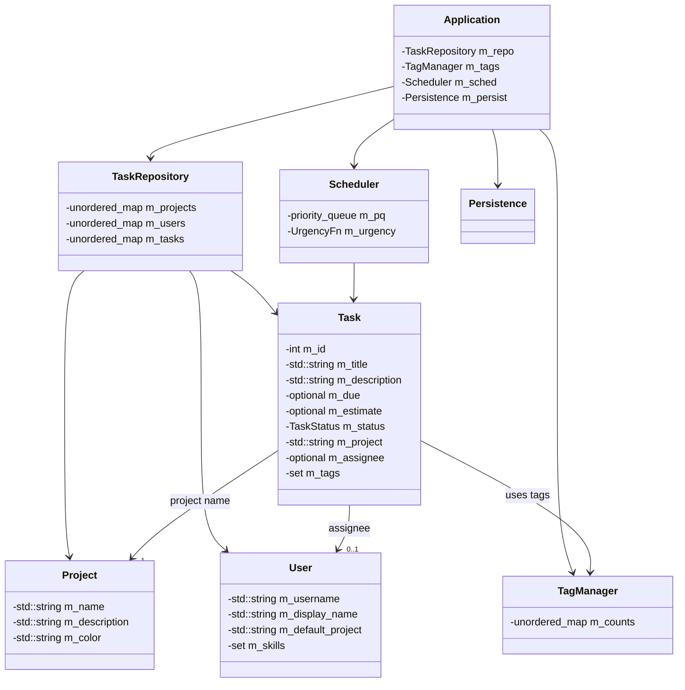

# Smart Task Manager — Class Descriptions & UML Diagram

This document gives a **brief description** of each class in the Smart Task Manager project and a **Mermaid UML class diagram** summarizing relationships.

---

## 🧩 Namespace
All classes are in the `stm` namespace.

---

## 📚 Class Descriptions

### 1) `Task`
Represents a single work item (e.g., assignment or feature). Stores identity, title/description, due date, estimate, status, owning project, optional assignee, and a set of tags. Provides basic tag operations.

### 2) `Project`
A container that groups related tasks under a common name and optional metadata (description, color). Helps organize tasks by context or goal.

### 3) `User`
Represents a person who can own or work on tasks. Tracks username, display name, default project preference, and a set of skill tags to describe interests/competencies.

### 4) `TagManager`
Maintains the global catalog of tags used across tasks. Tracks usage counts, supports adding/removing tags, and renaming tags to keep the taxonomy clean.

### 5) `TaskRepository`
Central in-memory store for `Project`, `User`, and `Task` entities. Offers CRUD operations and common filters (by project, tag, user), plus ID generation for tasks.

### 6) `Scheduler`
Prioritizes tasks using a configurable urgency scoring function and a priority queue. Exposes methods to load tasks, peek/pop the most urgent item, and clear the queue.

### 7) `Persistence`
Handles saving and loading the application state (projects, users, tasks) to/from a simple human-readable file format.

### 8) `Application`
The top-level CLI application orchestrating repositories, tag management, scheduling, and persistence. Runs the main loop and routes user commands to handlers.

---

## 🧭 UML Class Diagram (Mermaid)
> Paste into a Markdown renderer that supports Mermaid.

---

## 📌 Notes
- The diagram focuses on high-level relationships and key private members to show structure.
- You may extend classes with additional methods or fields in your implementation.

